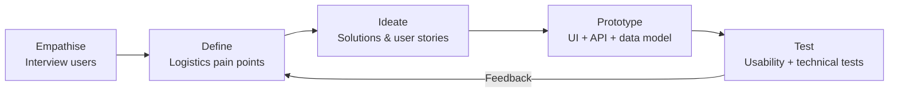
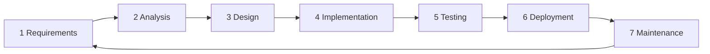
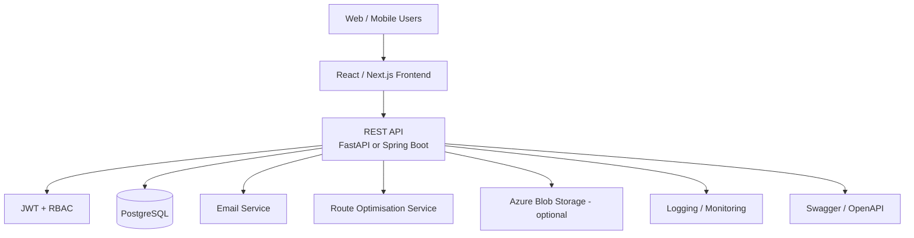
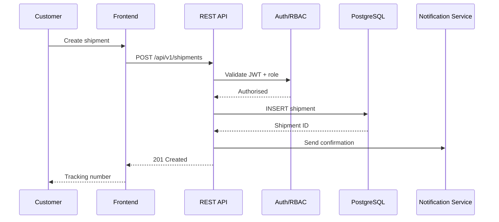
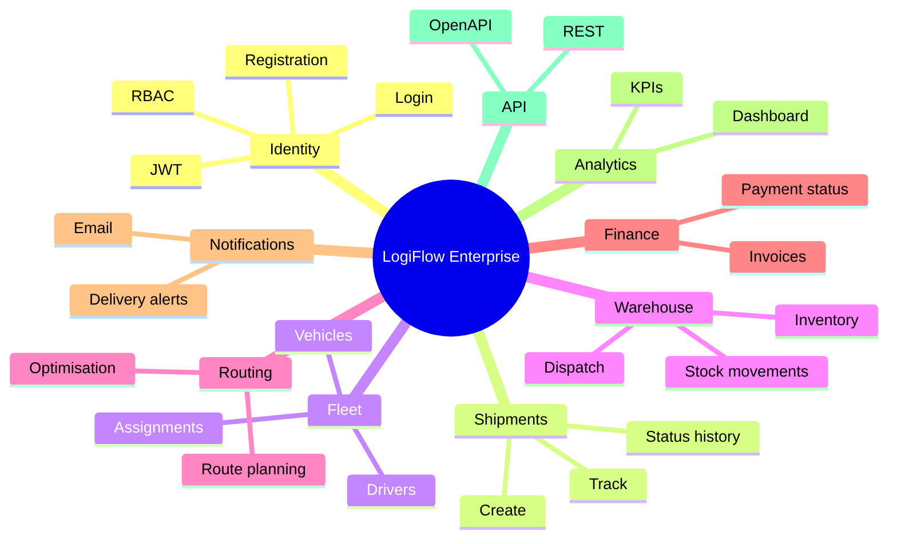
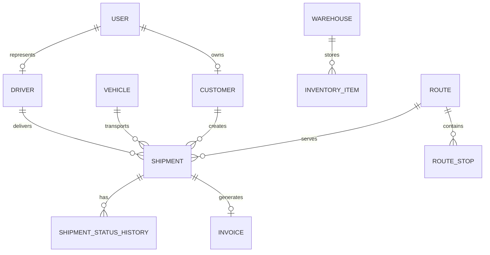
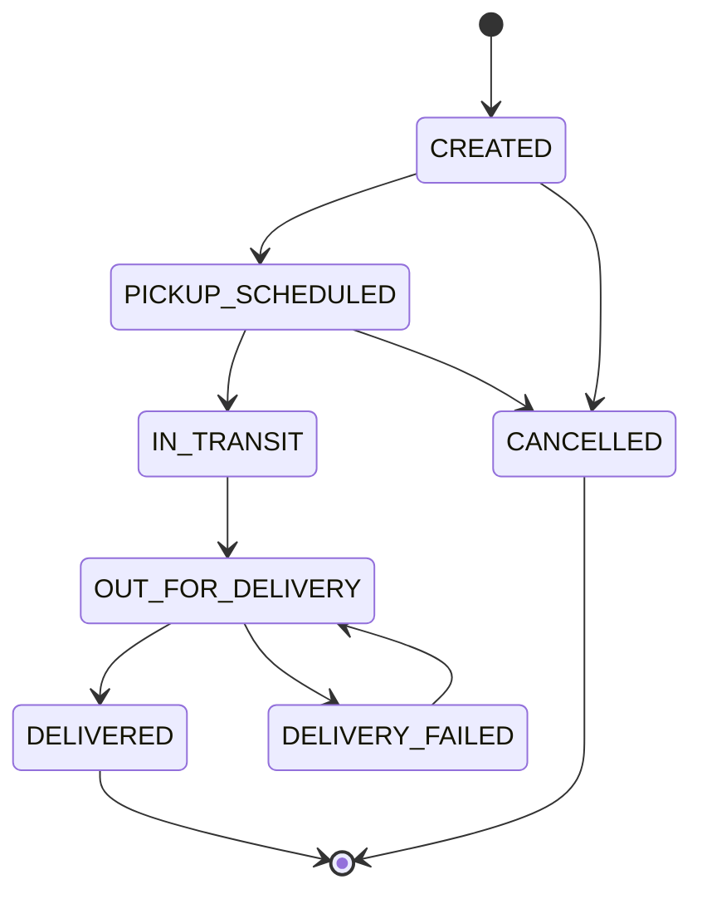
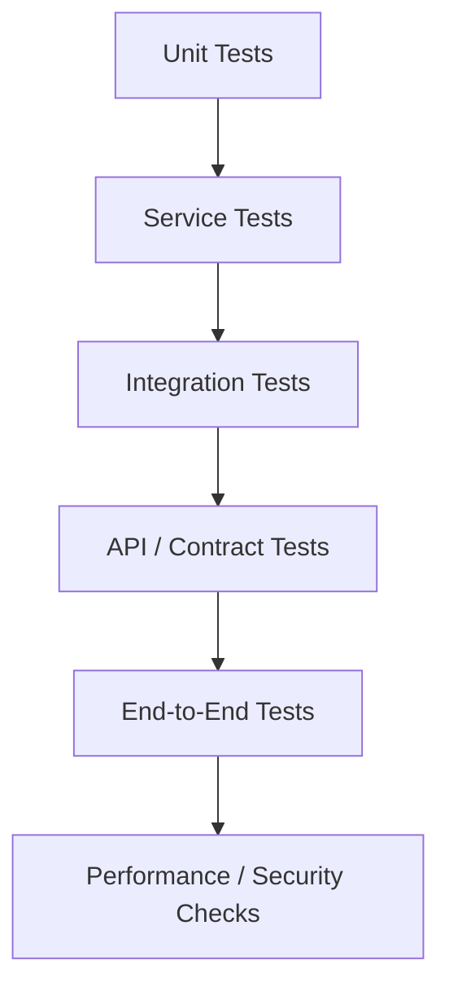

# LogiFlow Enterprise — Intelligent Logistics & Supply Chain Platform

> A complete academic + enterprise-grade software engineering project for managing customers, shipments, drivers, vehicles, warehouses, inventory, routes, invoices, notifications and analytics.

## 1. Project Vision

LogiFlow Enterprise is designed as a portfolio-quality logistics platform that demonstrates the full Software Development Life Cycle (SDLC): requirements engineering, design thinking, architecture, database design, secure connectivity, implementation, testing, CI/CD and cloud deployment.

### Core users
- Customer — creates and tracks shipments
- Driver — views assigned deliveries and updates status
- Warehouse Officer — manages inventory and dispatch
- Operations Manager — monitors routes and delivery performance
- Finance Officer — manages invoices
- Administrator — manages users, roles and platform configuration

## 2. Business Problem

Logistics organisations need a single source of truth for shipment lifecycle, inventory, drivers, vehicles, delivery status and financial records. LogiFlow connects these workflows through a secure REST API and relational database while providing analytics for operational decisions.

## 3. Design Thinking



### Evidence
- Stakeholder map
- Personas
- User journey maps
- Problem statement
- User stories and acceptance criteria
- Wireframes/prototypes
- Usability findings

## 4. SDLC



Every feature should have traceability:

**Requirement → User Story → Design → Code → Test → CI Result → Deployment**

## 5. Architecture & Connectivity



### Recommended technology

| Layer | Technology |
|---|---|
| Frontend | React.js / Next.js |
| Backend | Python FastAPI or Java Spring Boot |
| Database | PostgreSQL |
| Authentication | JWT + Role-Based Access Control |
| Testing | Pytest or JUnit + integration/API tests |
| DevOps | Docker + GitHub Actions |
| Cloud | Microsoft Azure |
| Documentation | Swagger / OpenAPI |

### Connectivity flow



1. Browser connects to frontend over HTTPS.
2. Frontend calls versioned REST endpoints.
3. API validates input and JWT.
4. RBAC authorises the operation.
5. Service layer applies business rules.
6. Repository/data-access layer communicates with PostgreSQL.
7. Database transaction commits or rolls back.
8. API returns a documented response.
9. Notifications are sent/queued where required.
10. Logs and metrics support monitoring.

## 6. Functional Modules



## 7. Database Design

Core entities:
- users
- roles
- customers
- drivers
- vehicles
- warehouses
- inventory_items
- shipments
- shipment_status_history
- routes
- route_stops
- invoices
- notifications



## 8. API Design

Use `/api/v1` for versioning.

| Method | Endpoint | Purpose |
|---|---|---|
| POST | `/api/v1/auth/register` | Register user |
| POST | `/api/v1/auth/login` | Authenticate user |
| POST | `/api/v1/shipments` | Create shipment |
| GET | `/api/v1/shipments/{id}` | Track shipment |
| PATCH | `/api/v1/shipments/{id}/status` | Update delivery status |
| GET | `/api/v1/drivers` | Manage drivers |
| GET | `/api/v1/vehicles` | Manage vehicles |
| GET | `/api/v1/warehouses/{id}/inventory` | View inventory |
| POST | `/api/v1/routes/optimise` | Optimise route |
| POST | `/api/v1/invoices` | Generate invoice |
| GET | `/api/v1/analytics/dashboard` | Dashboard KPIs |

Swagger/OpenAPI should document request schemas, response schemas, authentication, validation errors and HTTP status codes.

## 9. Shipment State Machine



Keep status history in `shipment_status_history` rather than overwriting operational history.

## 10. Route Optimisation

Start with a transparent baseline before advanced optimisation:

1. Validate addresses/coordinates.
2. Load active shipments and delivery windows.
3. Group stops by operational constraints.
4. Calculate a baseline route.
5. Apply an optimisation algorithm.
6. Compare distance/time against the baseline.
7. Save the selected route and stops.
8. Expose the result through the API.

Possible algorithms include nearest-neighbour, 2-opt, vehicle-routing heuristics, or a mapping/optimisation service.

## 11. Testing Methodology

Use layered testing rather than testing only the UI.



### Test levels
- **Unit:** business rules, validators and route calculations.
- **Integration:** API + PostgreSQL + repositories.
- **API/contract:** authentication, CRUD, validation and status codes.
- **End-to-end:** create shipment → warehouse dispatch → driver delivery → invoice.
- **Security:** authentication, authorisation, input validation, token expiry and access boundaries.
- **Performance:** response time, concurrency and database query performance.
- **Regression:** automated suite after changes.

### Example acceptance criterion
**Given** an authenticated customer, **when** valid shipment details are submitted, **then** the API creates one shipment, returns HTTP 201, generates a tracking number and records the initial status.

## 12. Test Traceability Matrix

| Requirement | Component | Test ID | Expected result |
|---|---|---|---|
| Customer registration | Auth service | AUTH-001 | Valid user created |
| Login | Auth service | AUTH-002 | JWT returned |
| RBAC | Security layer | SEC-001 | Forbidden role receives 403 |
| Shipment creation | Shipment service | SHP-001 | Shipment + tracking number created |
| Status update | Shipment service | SHP-002 | Valid transition recorded |
| Inventory | Warehouse service | INV-001 | Stock movement persisted |
| Route optimisation | Route service | RTE-001 | Valid optimised route produced |
| Invoice | Finance service | FIN-001 | Invoice generated |
| Email | Notification service | NOT-001 | Notification sent/queued |

## 13. DevOps & CI/CD

```mermaid
flowchart LR
    DEV[Developer] --> GIT[Git Branch]
    GIT --> PR[Pull Request]
    PR --> CI[GitHub Actions]
    CI --> LINT[Lint + Static Checks]
    LINT --> TEST[Unit + Integration Tests]
    TEST --> BUILD[Docker Build]
    BUILD --> SEC[Security Scan]
    SEC --> STAGE[Azure Staging]
    STAGE --> APPROVE[Release Approval]
    APPROVE --> PROD[Azure Production]
```



Suggested branches:
- `main` — production-ready
- `develop` — integration
- `feature/*` — features
- `fix/*` — bug fixes

## 14. Security Engineering

- HTTPS/TLS in deployed environments
- Secure password hashing
- Short-lived JWT access tokens
- Refresh-token strategy where appropriate
- RBAC on protected endpoints
- Server-side validation
- Parameterised queries/ORM protections
- Secrets outside source control
- Authentication rate limiting
- Audit logging
- Dependency and container vulnerability scanning

## 15. Academic Software Engineering Alignment

| Academic area | Evidence |
|---|---|
| Problem analysis | Problem statement + stakeholder analysis |
| Requirements engineering | SRS + user stories + acceptance criteria |
| Design thinking | Empathise → Define → Ideate → Prototype → Test |
| SDLC | Requirements → Design → Build → Test → Deploy → Maintain |
| Architecture | Context + C4 container/component diagrams |
| Database engineering | ERD + data dictionary |
| API engineering | REST + OpenAPI |
| Software quality | Test strategy + traceability matrix |
| Security | Threat model + RBAC + secure coding |
| DevOps | Git + PRs + CI/CD + Docker |
| Cloud | Azure deployment architecture |
| Project management | Issues + milestones + Git history |
| Innovation | Route optimisation evaluation |

## 16. Repository Structure

```text
LogiFlow-Enterprise/
├── backend/
│   ├── app/
│   │   ├── api/
│   │   ├── core/
│   │   ├── models/
│   │   ├── schemas/
│   │   ├── services/
│   │   └── repositories/
│   └── tests/
├── frontend/
│   ├── src/
│   │   ├── components/
│   │   ├── pages/
│   │   ├── services/
│   │   └── hooks/
│   └── tests/
├── database/
│   ├── migrations/
│   └── seeds/
├── docs/
│   ├── requirements/
│   ├── architecture/
│   ├── design-thinking/
│   ├── testing/
│   ├── security/
│   └── user-guide/
├── diagrams/
├── media/
│   ├── screenshots/
│   └── demo/
├── docker/
├── .github/workflows/
└── README.md
```

## 17. Documentation & Academic Evidence Pack

Create and maintain:

1. Project charter
2. Stakeholder analysis
3. Problem statement
4. Software Requirements Specification (SRS)
5. Functional/non-functional requirements
6. User stories + acceptance criteria
7. Use-case diagram
8. Context diagram
9. C4 architecture diagrams
10. ERD + data dictionary
11. API specification
12. UI wireframes
13. Threat model
14. Test strategy + test plan
15. Test cases + results
16. Requirements traceability matrix
17. Deployment guide
18. User manual
19. Technical report
20. Final presentation/demo script

## 18. Images, Diagrams & Video Demonstration

Use original diagrams, screenshots and recorded demonstrations created for the project. Avoid committing copyrighted stock images.

```text
media/
├── screenshots/
│   ├── login.png
│   ├── dashboard.png
│   ├── shipment-tracking.png
│   ├── warehouse.png
│   ├── route-optimisation.png
│   └── invoice.png
├── diagrams/
│   ├── system-context.svg
│   ├── architecture.svg
│   ├── erd.svg
│   ├── sequence-shipment.svg
│   └── cicd.svg
└── demo/
    └── LogiFlow-Demo.mp4
```

### 3–5 minute academic demo
1. Introduce the business problem.
2. Show design-thinking artefacts.
3. Explain architecture and connectivity.
4. Register/login and demonstrate RBAC.
5. Create and track a shipment.
6. Demonstrate warehouse/driver workflow.
7. Run route optimisation.
8. Generate an invoice.
9. Show Swagger/OpenAPI.
10. Show automated test results and GitHub Actions.
11. Show Docker/Azure deployment.
12. Conclude with limitations and future research.

## 19. Development Roadmap

### Phase 1 — Discovery
Problem definition → stakeholder research → personas → SRS.

### Phase 2 — Architecture & Design
Use cases → C4 diagrams → ERD → API contract → wireframes → threat model.

### Phase 3 — MVP
Authentication → customers → shipments → status tracking → PostgreSQL.

### Phase 4 — Operations
Drivers → vehicles → warehouses → inventory → routes.

### Phase 5 — Enterprise Features
Analytics → invoices → email notifications → audit logs.

### Phase 6 — Quality & Delivery
Automated tests → security tests → Docker → GitHub Actions → Azure → monitoring.

### Phase 7 — Academic Evaluation
Test evidence → performance results → limitations → research discussion → final report/demo.

## 20. Definition of Done

A feature is complete when:

- Requirement is documented.
- Acceptance criteria are defined.
- UI/API/database design is updated.
- Code is implemented.
- Unit and relevant integration/API tests pass.
- Security is reviewed.
- API documentation is updated.
- README/docs are updated.
- CI pipeline passes.
- Pull request is reviewed.
- Feature is demonstrated with evidence.

## 21. Future Enhancements

- IoT vehicle telemetry
- Predictive ETA
- Demand forecasting
- AI-assisted route optimisation
- Real-time map tracking
- Kafka/Azure Service Bus event-driven architecture
- Mobile driver application
- Multi-tenant architecture
- Anomaly detection
- Sustainability/carbon-emission analytics

---

**Project:** LogiFlow Enterprise  
**Repository:** `Mjmuhiya/Enterprise-Logistics-Management-System`  
**Focus:** Software Engineering · Full Stack · Cloud · DevOps · Testing · Data · Logistics
