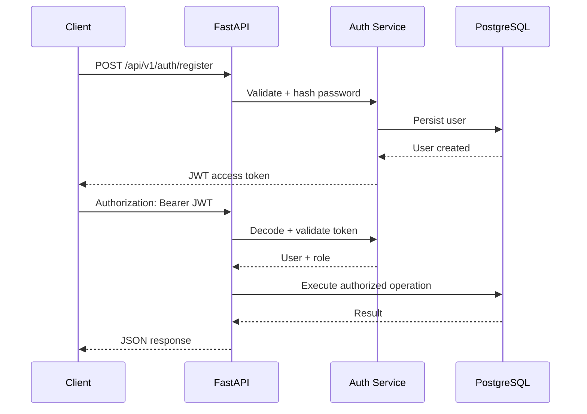
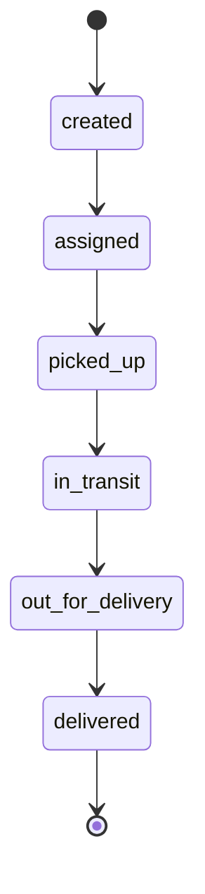

# Phase 2 — Authentication, RBAC & Shipment Domain

## Objective
Implement the first protected business workflows while preserving traceability from requirements to API behaviour and automated tests.

## Security flow

## RBAC matrix
| Capability | Customer | Driver | Warehouse Manager | Admin |
|---|---:|---:|---:|---:|
| Register/Login | ✓ | ✓ | ✓ | ✓ |
| View shipments | ✓ | ✓ | ✓ | ✓ |
| Create shipment | ✓ | — | — | ✓ |
| Change shipment status | — | ✓ | ✓ | ✓ |

## Shipment lifecycle

## Test strategy
- Authentication: registration, login and protected endpoints.
- Authorization: role-based access to shipment operations.
- Domain validation: invalid shipment status transitions return HTTP 400.
- Integration: API requests are exercised through FastAPI TestClient.

## Academic traceability
| Requirement | Design | Implementation | Verification |
|---|---|---|---|
| Secure user access | JWT + RBAC | `security.py`, auth endpoints | `test_auth_shipments.py` |
| Shipment management | REST resource | shipment endpoints | integration tests |
| Controlled lifecycle | state transition model | `STATUS_FLOW` | transition test |
