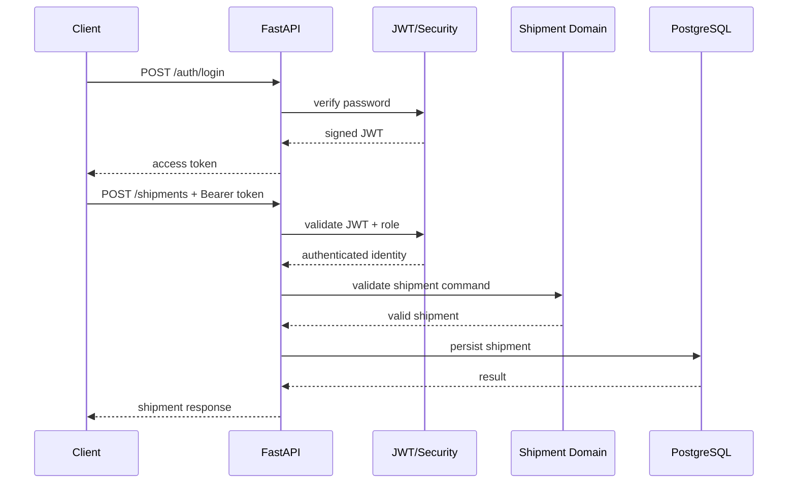
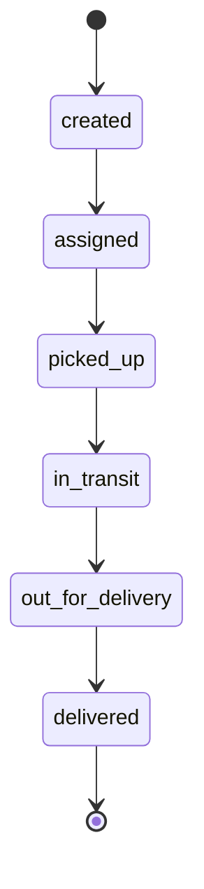

# Phase 2 — Authentication & Shipment Lifecycle

## Objective
Implement a secure vertical slice from identity to shipment tracking while maintaining explicit software-engineering traceability.

## Connectivity

## Shipment state machine

## Traceability
| Requirement | Design | Implementation | Verification |
|---|---|---|---|
| User authentication | JWT + password hashing | `/auth/register`, `/auth/login` | `test_auth.py` |
| RBAC | Role dependency | `require_role()` | shipment authorization tests |
| Shipment creation | REST command | `POST /shipments` | shipment integration test |
| Shipment tracking | State machine | `GET /shipments/{id}` | retrieval test |
| Valid status changes | Domain transition rules | `STATUS_FLOW` | invalid transition test |

## Academic alignment
- **Requirements engineering:** explicit functional requirements and acceptance behaviour.
- **Design:** sequence and state diagrams before implementation.
- **Implementation:** layered API/security/domain separation.
- **Testing:** automated integration tests linked to requirements.
- **Quality:** authentication, authorization, validation and traceability.

> PostgreSQL persistence is introduced through the SQLAlchemy foundation and is the next hardening step for the vertical slice.
